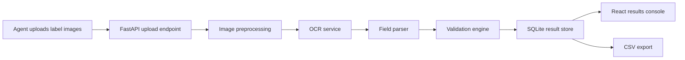

# AI-Powered Alcohol Label Verification App

Production-quality MVP prototype for a U.S. Treasury TTB label review workflow. The app lets compliance agents upload alcohol label images, run OCR, parse required label fields, validate extracted data against expected application records, and export field-level results to CSV.

## Architecture

- Frontend: React, TypeScript, TailwindCSS, Vite
- Backend: Python FastAPI, Pydantic, SQLite
- OCR: local Tesseract default, EasyOCR-ready service layer, and deterministic fixture-only demo mode
- Image preprocessing: grayscale conversion, illumination/glare normalization, contrast enhancement, noise reduction, adaptive thresholding, and deskewing when OpenCV is available
- Storage: SQLite for prototype review history
- Packaging: Dockerfiles and `docker-compose.yml`



## Quick Start

```bash
docker-compose up --build
```

Open:

- Frontend: [http://localhost:5173](http://localhost:5173)
- API docs: [http://localhost:8000/docs](http://localhost:8000/docs)
- Health check: [http://localhost:8000/api/health](http://localhost:8000/api/health)

The default Docker setup uses locally installed Tesseract so a reviewer can upload arbitrary label images without outbound network dependencies. The three bundled sample images are recognized by filename and SHA-256 content checksum and evaluated as controlled fixtures, so the demo produces its documented outcomes without misrepresenting Tesseract accuracy.

## Hosted Demo

Live demo (public): https://huggingface.co/spaces/jting2013/ttb-label-verifier-poc

This repository remains deployable via the included root `Dockerfile`, which compiles the React frontend and serves it from FastAPI on port `7860` as a single production container.

## Local Development

Backend:

```bash
cd backend
python -m venv .venv
source .venv/bin/activate
pip install -r requirements.txt
cp .env.example .env
uvicorn app.main:app --reload --port 8000
```

Frontend:

```bash
cd frontend
npm install
cp .env.example .env
npm run dev
```

Generate sample images if needed:

```bash
python scripts/generate_sample_labels.py
```

Generate a ten-file demonstration batch with no local Python dependency:

```bash
./scripts/generate_samples.sh 10
```

Or, after installing the backend Python dependencies, run the configurable generator directly:

```bash
python scripts/generate_sample_labels.py --count 10 --clean
```

Additional batches are written to `sample_data/generated_labels`, with expected outcomes in `sample_data/expected/generated_outputs.json`. Generated fixtures include clean, rotated, blurred, glare, warning-format, ABV, net-content, and brand-mismatch scenarios. While the backend container is running through Docker Compose, newly generated fixture registrations are picked up without a rebuild.

## Demo Workflow

1. Start the app with `docker-compose up --build`.
2. Open the frontend.
3. Click `Run Sample Batch`, or upload files from `sample_data/labels`.
4. Select a result row to inspect field-by-field expected vs extracted values.
5. Use `Export CSV` to download the review report.

Sample files:

- `valid_old_tom.png`: expected passing label
- `invalid_warning.png`: incorrect government warning casing and wording
- `rotated_blurry.png`: rotated and blurred sample for preprocessing demonstration

Mock expected application data lives in `sample_data/expected/mock_applications.json`.

Bundled sample images display `sample-fixture` as their OCR source. Changing or renaming the files causes them to follow the configured OCR path instead of inheriting controlled results.

Generated demonstration batches also display `sample-fixture` only when their content matches the generated checksum manifest. This keeps repeatable demo outcomes distinct from real OCR evaluation.

An example static UI mockup is included at `docs/mockups/dashboard_mockup.png`.

## API Overview

FastAPI exposes OpenAPI documentation at `/docs`.

### Health

```http
GET /api/health
```

### Upload and Validate Labels

```http
POST /api/labels/upload
Content-Type: multipart/form-data

files=<one-or-more-image-files>
application_id=APP-OLD-TOM-001
```

Response includes:

- `batch_id`
- `summary`
- per-file OCR confidence, parsed fields, validation status, and explanations

### OCR Only

```http
POST /api/ocr/extract
```

### Built-In Demonstration Batch

```http
POST /api/samples/demo
```

Runs the three controlled sample labels and returns the documented `2 PASS / 1 FAIL` summary. This is intended for reviewer walkthroughs; uploaded files use the configured OCR engine.

### Results and Export

```http
GET /api/results
GET /api/batches/{batch_id}
GET /api/exports/results.csv
```

On the public hosted configuration, server-side result history is disabled and CSV export is generated in the browser from the active batch.

## Validation Rules

- Brand names use case-insensitive and punctuation-tolerant matching.
- Class/type, net contents, producer, and country use field-specific fuzzy thresholds.
- Alcohol content validates ABV and proof values from common formats.
- Government warning validation requires exact uppercase `GOVERNMENT WARNING:` prefix and checks required wording.
- The warning heading must also be bold. Bundled generated fixtures carry verified bold-heading metadata; text-only OCR results receive `WARNING` until an agent visually confirms bold formatting.
- Overall status is `FAIL` when any field fails, `WARNING` when any field warns, otherwise `PASS`.

## OCR Notes

`OCR_ENGINE=tesseract` is the default for offline review of arbitrary images. Supported values:

- `OCR_ENGINE=easyocr`: uses EasyOCR with CPU mode
- `OCR_ENGINE=tesseract`: uses local Tesseract
- `OCR_ENGINE=demo`: deterministic fixture testing mode; only checksum-matching bundled samples are recognized

Docker installs Tesseract and Python OCR/image dependencies. EasyOCR may download model weights on first use, which can be slow or blocked on restricted networks. Controlled fixtures are checksum verified, and demo mode intentionally fails unrecognized or modified files rather than applying sample OCR text to a real submission.

## Testing

```bash
cd backend
pytest
```

Covered areas:

- validation engine behavior
- government warning strictness
- warning-heading typography evidence handling
- ABV/proof validation
- upload API valid, invalid, and unrecognized-demo paths

## Troubleshooting

- If the frontend cannot reach the API, confirm both containers are running and that port `8000` is free.
- If EasyOCR startup is slow, switch back to `OCR_ENGINE=demo`.
- If Tesseract OCR returns poor text, use clearer source images or enable the OpenCV preprocessing dependencies from `requirements.txt`.
- On Apple Silicon, Docker Desktop may need more memory for EasyOCR. Demo mode does not require that.

## Assumptions and Creative Problem Solving

- SQLite is used for prototype persistence and local review history.
- Batch processing is synchronous for MVP simplicity; the service boundary can later move to Redis/RQ or Celery.
- Poor image quality is addressed through grayscale conversion, broad illumination/glare normalization, denoising, contrast enhancement, adaptive thresholding, and deskewing before OCR. The rotated/blurry fixture exercises that workflow deterministically in demo mode; it is not presented as an OCR accuracy benchmark.
- Controlled fixture processing maps only bundled, checksum-matching sample files to deterministic OCR text so reviewers can validate the full workflow offline; unknown or modified uploads fail closed in demo mode and use real OCR in normal operation.
- OCR reliably supplies text content, but basic Tesseract/EasyOCR extraction does not prove font weight. The prototype flags otherwise-valid warning text for agent visual confirmation unless typography evidence is available from a controlled fixture.
- The parser is rule-based and intentionally transparent. A future production version could combine OCR geometry, ML extraction, and human-in-the-loop correction.

## Future Enhancements

- Redis-backed asynchronous batch queue
- Role-based access and audit logging
- Human correction workflow with reviewer annotations
- Computer-vision typography and minimum-font-size checks for the government warning statement
- PDF and multi-label package support
- Pre-approved OCR model packaging for restricted networks
- COLA/application system integration
- Validation rule admin interface with versioned rule sets
